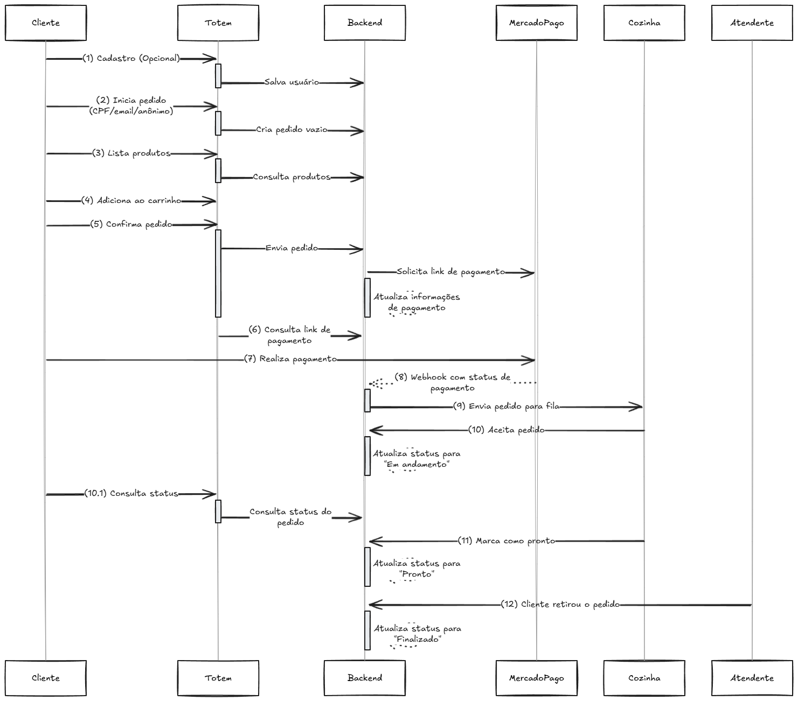
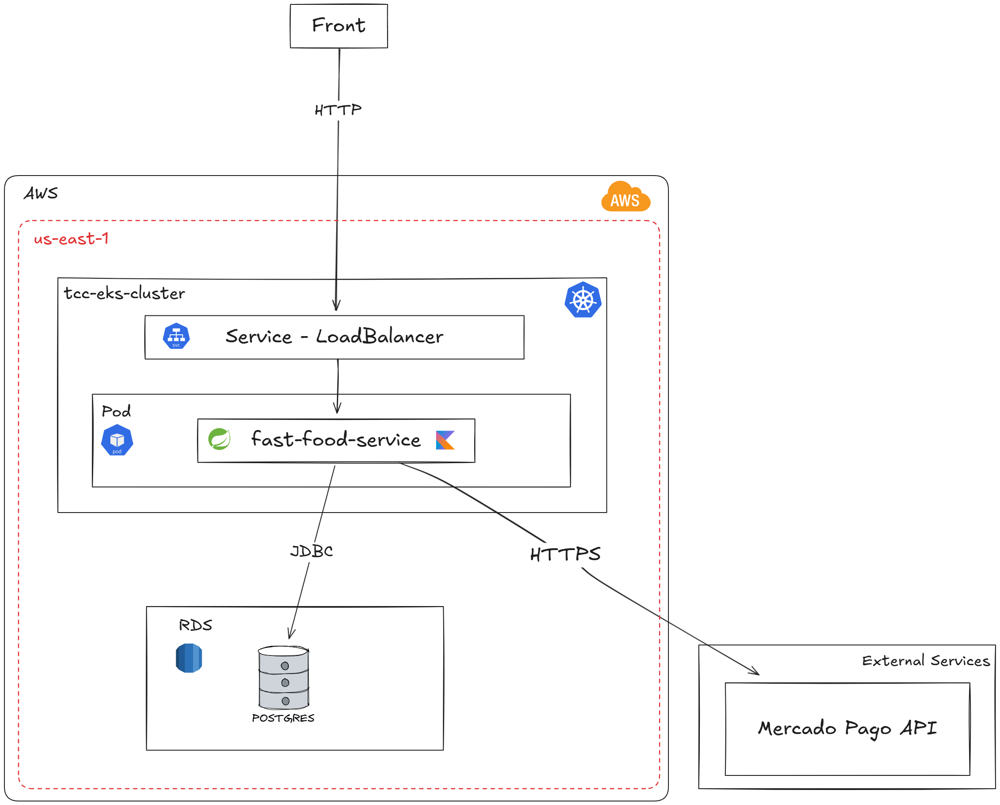
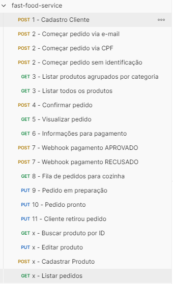

# FastFood

A aplicação é um sistema de autoatendimento para uma lanchonete em expansão, desenvolvido para otimizar o controle de pedidos, reduzir erros no atendimento e melhorar a experiência do cliente. Ela permite que os usuários façam pedidos personalizados (lanche, acompanhamento e bebida), realizem pagamentos via QR Code do Mercado Pago e acompanhem o status do pedido. O sistema também oferece API's para gestão de produtos, categorias, clientes e pedidos.

## Funcionalidades

- Cadastro e gerenciamento de clientes
- Cadastro e gerenciamento de produtos e categorias
- Criação e confirmação de pedidos
- Processamento de pagamentos via Mercado Pago
- Acompanhamento do status dos pedidos (criado, confirmado, em preparação, pronto, finalizado)
- Eventos e listeners para atualização de status e notificações
- Retirada do pedido pelo cliente

## Arquitetura do Projeto

### Tecnologias Utilizadas

- Kotlin
- Spring Boot
- Gradle
- Clean Architecture
- JUnit 5 e MockK (testes unitários)
- Swagger (documentação da API)
- Mercado Pago (integração de pagamentos)
- PostgreSQL / RDS
- Docker e Docker Compose
- Kubernetes / EKS
- GitHub Actions (CI/CD)

### Estrutura do Projeto

O projeto segue o padrão Clean Architecture, promovendo separação de responsabilidades, independência de frameworks e facilidade de manutenção. A estrutura está dividida em três camadas principais:

- **Domain**: Contém as entidades de negócio e regras de domínio. Não possui dependências com outras camadas. Localização: `camadas/domain`.
- **Application**: Implementa os casos de uso da aplicação, orquestrando as regras de negócio e interagindo com a camada de domínio. Localização: `camadas/application`.
- **Infrastructure**: Responsável pela implementação de detalhes externos, como persistência, APIs, integrações e frameworks. Depende das camadas de domínio e aplicação, mas não o contrário. Localização: `camadas/infrastructure`.

A comunicação entre as camadas é feita por meio de interfaces, garantindo baixo acoplamento e alta testabilidade. Cada camada possui seu próprio módulo Gradle, facilitando a gestão de dependências e builds independentes.


### Diagrama de sequência da aplicação



### Visão geral da arquitetura



## Como executar a aplicação via Docker

### Requisitos

- Docker instalado
- Docker Compose instalado

### Passo a passo

1. Baixe o docker compose do projeto disponível no repositório:
   ```sh
   https://github.com/felixgilioli/fast-food-service/blob/main/demo/docker-compose.yml

2. Baixe o arquivo secrets.env no mesmo diretório do docker-compose


3. Execute o comando abaixo para subir o banco de dados e a aplicação:
   ```sh
   docker-compose --env-file secrets.env up -d

## Como executar localmente

### Requisitos

- Java 21 instalado
- Docker instalado
- Docker Compose instalado

### Passo a passo

1. Clone o repositório:
   ```sh
   https://github.com/felixgilioli/fast-food-service.git

2. Suba o banco de dados com Docker Compose:
   ```sh
   cd fastfood/local
   docker-compose up -d

3. Volte para o diretório raiz do projeto:
   ```sh
   cd ..

4. Execute o projeto informando as variáveis de ambiente necessárias:

   #### Linux / macOS

   ```bash
   MERCADO_PAGO_ACCESS_TOKEN=TEST-xxx
   ./gradlew bootRun --args='--spring.profiles.active=local'
   ```

   #### Windows (PowerShell)
   
   ```bash
   $env:MERCADO_PAGO_ACCESS_TOKEN="xxx"
   ./gradlew bootRun --args='--spring.profiles.active=local'
   ```

## Para testar a aplicação

Importe o arquivo `local/postman/fastfood.postman_collection.json` no Postman e execute as requisições disponíveis. As requisições estão organizadas em sequências para facilitar o teste do fluxo de pedidos.



Se preferir, você pode acessar a documentação da API via Swagger em http://localhost:8080/swagger-ui/index.html.


## Infraestrutura

### CI/CD

Para realizar o deploy da aplicação, foi utilizado o GitHub Actions. O workflow está configurado para ser acionado quando for feito um push na branch main. A esteira é responsável por realizar o build da aplicação, montar a imagem Docker, fazer o push para o DockerHub (https://hub.docker.com/repository/docker/felixgilioli/fastfood-service/general) e atualizar o deployment no EKS.

### Cloud

A infraestrutura do projeto é toda provisionada via Terraform e está disponível no repositório: https://github.com/felixgilioli/tcc-infrastructure-tf

O Terraform é responsável por criar o cluster EKS, a instância do banco de dados PostgreSQL no RDS, além de configurar a rede (VPC, subnets, security groups) e armazenar o estado do Terraform em um bucket S3.